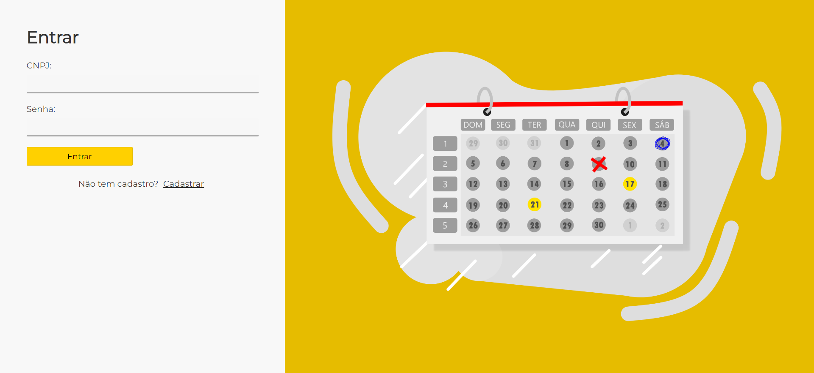
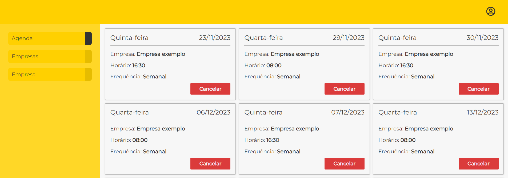
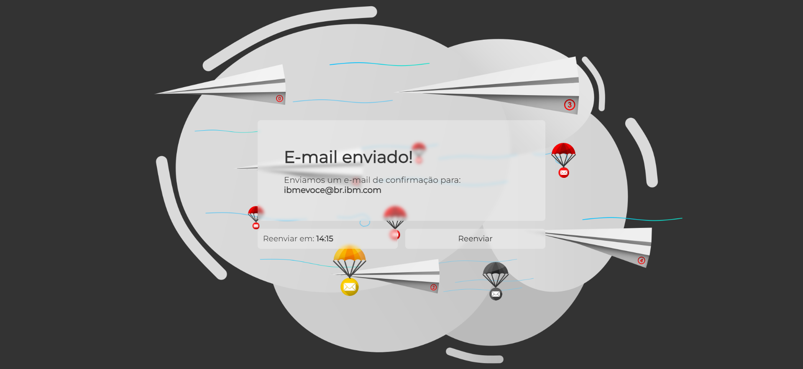

Api de uma aplicação de agendamentos para entregadores em supermercados!

Certifique-se de ter o `nodejs` e `docker` instalado na máquina.

O primeiro passo será clonar o repositório para sua maquina.

Então na raiz do projeto, digite no terminal: `npm install`, para baixar todas as dependências e pacotes.

Feito isso, o projeto estará pronto para iniciar, digitando no terminal: `npm run initialize`.
Isso será responsável por inicializar o docker, as migrações do banco de dados, a seed do banco de dados e por último o servidor.

Caso, não seja sua primeira vez rodando o projeto, basta apenas digitar `npm run dev`. Então o docker e o servidor serão inicializados.
